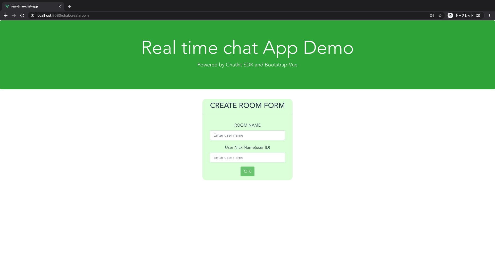

# リアルタイムチャットアプリケーション (real-time-chat-app)
Qiitaの2020年のフロントエンドマスターになりたければこの9プロジェクトを作れ(https://qiita.com/rana_kualu/items/915345b8f3f870cfe2aa)
を参考に、リアルタイムチャットアプリケーションを作成。デザインや主要な処理の実装は、チュートリアルの通りとなっており、以下のような機能を追加した。

## 追加したの機能

* ユーザー登録機能
* ルーム作成機能
* ルーム入室機能
* ルーム退室機能

 
## 開発環境

* Vue.js
* Vuex
* Vue Router
* bootstrap-vue
* chatkit

 
## 画像
* ホーム画面

* ユーザー作成画面

* ルーム作成画面

* ルーム入室画面

* ルーム退室画面

